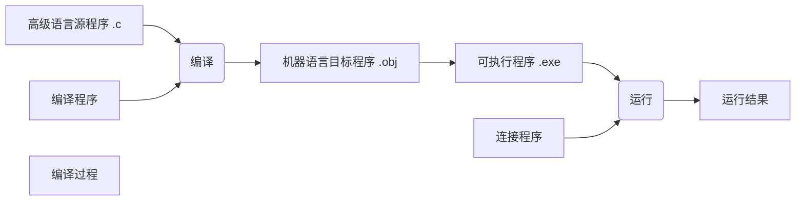

# C语言简介

***

## 特点

语言简洁，表达能力强，易于理解

可直接访问__物理地址__

> 只有32个关键字，9种控制语句
> 数据构造能力强
> 运算符丰富
> 程序书写格式自由

语言生成的代码质量高

可移植性好

***

## 编译



***

__第一个程序Hello World__

```C
#include <stdio.h>

int main()
{
    printf("Hello World!");
    return 0;
}
```

***

__计算一个数的平方__

```C

#include <stdio.h>/*包含stdio.h（预处理指令）
.h头文件  std标准
stdio = standard input output*/

#include <stdlib.h>
/*包含stdlib.h（预处理指令）
lib库*/

int main()
{
    float a,b;//定义两个变量a,b（类型float  浮点数）
    a = 5.2;//将5.2赋值给a
    b = a*a;//讲a^2赋值给b
    printf( "%f\n", b );//，调用输出函数printf，以format格式方式打印b
    printf( "Hello World!\n" )
    return 0;//返回语句，main函数结果
}

```

<kbd> \n </kbd>表示换行符

<kbd> {} </kbd>程序体外壳

！！！__写程序时每执行完一步务必加<kbd> ; </kbd>__

***

__输入两个数，输出其中单位大数__（return实例）

```C
int max( int x,y )//编写max函数
{
    int z;
    if( x > y )
        z = x;
    else
        z = y;
    return(z);
}
void main()//主函数
{
    int a,b,c;
    scanf("%d, %d",&a, &b);
    c = max(a,b);//调用max函数，求a和b中大者
    printf("max = %d\n, c")
}
```


__注意分行！便于理解__


```C
#include <bits/sdc++.h>
//万能头文件
```


***


***

# Chapter 1

***

+ **程序设计语言**

+ **程序设计的本质**

+ **算法**

+ **算法的表示**

+ **结构化的程序设计**

***

## 程序设计语言

+ 程序是用来完成特定功能的一系列指令
+ 通过向计算机发布指令，程序设计人员可以控制其执行某个操作或进行某种运算
+ 一组指令构成一个程序，可以用来解决一个具体问题

==指定计算机执行语句的顺序被称为**程序控制**==

### 语言的分类

1. 机器语言（效率最高，移植性最差）

2. 汇编语言（效率与移植性次之）

3. 高级语言（效率很低，移植性很好，编写简单）

4. 面向对象的程序设计语言：构件化的语言【e.g. VB/VC/Java/C#】（移植性最强，更易于编写，效率最差）

   

### 编程语言的分层结构

+ 编程语言的分层结构思维，以下层语言为基础，再定义一套能力更强的新语言和编译器

+ 人们使用新语言高效率地编写程序，使用编译器将其编译成下层语言能识别的源程序

  

### 语言的执行方式

+ 编译执行：
  + 将源程序翻译生成一个可执行的目标程序，该目标程序可以脱离编译环境和源程序独立储存和执行
  + C、C++...

+ 解释执行：
  + 将源程序逐句解释成二进制指令，解释一句执行一句，不生成可执行文件，他的执行速度比编译方式慢
  + Basic、Java...

### 语言的版权问题与国产编程语言


***

## C语言简介

> + C语言是书写UNIX操作系统的语言
> + C语言是结构化的程序设计语言，它功能丰富、使用灵活、可移植性好
> + 广泛应用于科学计算、工程控制、网络通讯、图像处理等领域。C语言是特别适宜作为学习程序设计的语言，也是实用性较强的编程语言
> + 具体发展过程与特点，参考教材

C语言由函数构成。一个C语言至少由一个构成，而且至少包含一个名为main的主函数。

``` C
#include<stdio.h>
void main()//函数头部
{
    printf("I like programming");
    return 0;
}//“{}”函数体；“printf”打印输出函数
```

### 冯·诺伊曼系统结构计算机

+ 由控制器、运算器、存储器、输入设备和输出设备五部分组成
+ 采用二进制，指令和数据均以二进制数形式表示和存放
+ 按照程序规定的顺序将指令从存储器中取出，并逐条执行


***

## 程序设计的本质

**程序设计的本质是设计能够利用计算机的五个部件完成特定任务的指令序列**

``` C
#include<stdio.h>//预处理指令
void main()
{
    int price,number,total;
   printf("Input price，number\n") scanf("%d%d",&price,&number);//输入一串数据并存储在“price”、“number”变量中（输入设备，存储器）
    total = price * number;//使用存储数据进行运算（运算器）
    printf("total=%d\n",total);//输出运算后想要得到的结果（输出设备）
    return 0;
}
```

控制台中输出为：

```cmd
10 3
total = 30
Press any key to continue.
```

==所有输入/输出都是以**流**的形式处理的==

<kbd>%d</kbd>占位符，为后面内容占位

<kbd>&</kbd>取出地址，定义变量

***

## 程序设计过程

+ 分析和定义实际问题
+ 建立处理模型
+ 设计算法
+ 设计流程图
+ 编写程序
+ 调试程序和运行程序

***

## 算法的概念和特性

> *解决一个问题所采取的一系列步骤叫作算法*

Nicklaus Wirth提出了一个公式：

	程序 = 数据结构 + 算法

+ 数据结构是指在程序中数据的类型和组织形式
+ 算法给出了解决问题的方法和步骤，是程序的灵魂
+ 它能决定如何操作数据，如何解决问题
+ 同一个问题可以有多种不同算法

### 算法的特点

+ 有穷性（必须有终止）
+ 确定性（必须解释为一种含义）
+ 输入（可选）
+ 输出（必需）
+ 可行性（必须可执行）

# 程序设计过程

***

+ **分析和定义实际问题**
+ **建立处理模型**
+ **设计算法**
+ **设计流程图**
+ **编写程序**
+ **调试程序和运行程序**

***

## 算法复习

程序 = 数据结构 + 算法

***

## 算法的描述方法

1. 自然语言描述
2. 伪代码

>*if A大于B，then最大值为A，else最大值为B*

3. 传统流程图


4. N-S流程图 (盒图)


***

## 结构化的程序设计

1966年, Bohra和Jacobine提出了**顺序结构、选择结构和循环结构**三种基本结构

且这三种基本结构可以设计任何算法

故结构化程序设计方法只使用这三种基本结构组成算法

### 顺序结构

语句1->语句2->语句3

### 选择结构

判断条件处分开, 导向不同语句

条件-->成立-->语句1

条件-->不成立-->语句2

### 循环结构

通过设定循环条件,在满足该条件之前反复执行某段语句的反复执行循环体.

条件-->成立-->执行循环体

条件-->不成立-->跳出循环体


***程序设计采用自上而下 逐步细化 功能模块化的方法***

***

## 编程工具介绍

+ Visual C++ 
+ Dev C++

**下载务必去官网! ! ! ! ! !**

Visual Studio下载Community社区版

下载地址: https://visualstudio.microsoft.com/zh-hans/

*( Visual Studio Code配置较复杂,不建议新手使用 )*

断点: 程序执行至此处暂停,继续后才能继续; 用于分段调试

*部分编程软件单击左侧行序号即可添加断点*

Dev C++官方下载地址: https://sourceforge.net/projects/orwelldevcpp/

# 顺序结构程序设计

***

集成编译环境（IDE）选择：

+ Visual Studio
+ Dev C++
+ Code::Blocks
+ Visual Studio Code

（入门时选择一种，入门后可以根据功能喜好选择）

安装 **Install**

尽量不要安装C盘，为系统腾出空间

编译器优先选择 **gcc**

***

顺序结构是结构化程序设计中最简单的控制结构，它一般包括 **输入数据 (Input)、处理 (Process)、输出数据 (Output)** 三个步骤

程序设计过程的一般步骤：

1. **分析问题** ：分析问题原理，找出其中规律。
2. **设计算法** ：根据分析设计解决问题的算法。
3. **编写程序** ：编写程序，调试、运行程序。

***

#### 【例3.1】 编写程序，输入三角形的3条边长a、b和c，求三角形的面积。

1. 分析问题

$$
S=(a+b+c)/2
$$

$$
area=sqrt(s(s-a)(s-b)(s-c))
$$

2. 设计算法


3. 编写程序

```C
#include<stdio.h>
#include<stdlib.h>
#include<math.h>//下方调用math.h内sqrt函数，提前包含

int main()
{
    float a,b,c,s,area;//定义float类数据
    scanf("%f%f%f",&a,&b,&c);//输入
    
    s = (a+b+c)/2;
    area = sqrt(s*(s-a)*(s-b)*(s-c));//调用math.h内sqrt函数
    
    printf("area = %f\n",area);//输出
    
    return 0;
}
```

4. 其他算法思考


**以尽量减小资源占用（处理量、内存占用量）为最佳选项**

不断总结困难，勇于探索，形成自己的思路，加强编程能力

***

#### 【例3.29】 求解鸡兔同笼问题。一直笼中鸡兔头数h，脚数f，问鸡兔各几只？

1. 分析

设鸡兔分别 *x* 只， *y* 只，输入h和f解方程组

2. 设计


3. 编写

```C
#include<stdio.h>
#include<stdlib.h>

int main()
{
    int h,f,x,y;//定义int类型
    printf("Please input h & f :\n");//输出提示
    scanf("%d%d",&h,&f);//输入数值
    
    x = (f-2*h)/2;
    y = h-x;//处理运算
    
    printf("x = %d,y = %d",x,y);//输出结果
    
    return 0;
}
```

***

#### 【例3.30】  编写程序，输入一个三维整数，将其个位、十位和百位数反序后，得到一个新的整数并输出。

1. 分析

首先必须求得其个位、十位和百位数。

再计算得到反序后的数。

<kbd>%</kbd> **求余运算**

> 234%10 = 4（求个位数）
>
> 234/10%10 = 3（求十位数）

2. 设计


3. 编写

```C
#include<stdio.h>
#include<stdlib.h>


int main()
{
    int m,a,b,c,n;
    scanf("%d",&m);
    
    a = m%10;
    b = m/10%10;
    c = m/100%10;
    n = a*100+b*10+c;
    
    printf("n = %d\n",n);
    
    return 0;
}
```

***

在实际编程过程中，错误时常发生，很少有程序在第一次编译运行时就完全正确。

程序中经常出现的错误包括：

+ 语法错误
+ 运行时错误
+ 未检测到的错误
+ 逻辑错误

……

<kbd>;</kbd><kbd>{}</kbd>和其它标点符号记得使用 **英文符号**

# 

***

## 语法错误


1. 变量未被定义

```
error: 'a' undeclared
```


2. 语句后缺少分号 `;`

 ``` 
 error: expected "," or ";" before...
 ```


3. 忘记包含所需要的库函数头文件

``` c
#include <stdio.h>
#include <stdlib.h>
```

4. 忘记乘法运算符`*`

```c
a = 3b
```

5. **字符串**两边的 `""` 未成对出现
6. 花括号 `{}` 不配对
7. 小括号 `()` 不配对
## 运行时错误

编译器编译时不违法，但运行时计算机报错

（数学表达式无意义）

## 未检测到的错误

1. "scanf" 和 "printf" 的占位符类型与数据不统一

```
float <---> %f
int <---> %d
```

2. 赋值给变量时数据超出变量类型的取值范围

|    byte    |     short      |               int               |      long      | char |
| :--------: | :------------: | :-----------------------------: | :------------: | :--: |
| -128 ~ 127 | -32768 ~ 32767 | - 2,147,483,648 ~ 2,147,483,647 | -2^63 ~ 2^63-1 |  /   |

3. "scanf" 中忘记使用变量的取地址符号 `&`

```c
scanf("%d%d",a,b)
```

4. 运行程序时输入数据的方式与"scanf"中要求的输入格式不一致

5. 整数除法导致的变量类型与数据不一致（使用浮点数表示运算结果）

``` c
#include <stdio.h>

int main()
{
    int a,b;
    scanf("%d",&a);
    b = 5/9*a;
    printf("%d,%d\n",a,b);
    return 0;
}
```

```
input 9
output 9,0
//a = 9,b = 0
```

## 逻辑错误

逻辑错误是指不正确的算法导致的，符合语法和逻辑，因此较难debug

制定一份完善的测试方案，设计包括所有可能情况的测试用例，通过 **程序调试** 与用例比对

**设置断点** 来一步一步调试

***

# **C语言编程基础**

## 数据类型


### 基本数据类型

**整型** : 


**长整型** : 数字后加 `L`

> `123L `
>
> `123l`

**八进制** : 数字前加 `0`

> `0567`

**十六进制** : 数字前加 `0x`

> `0x12fd`
>
> `0X12fd`

**二级制在计算机中存储常用四位存储法**

**实型** : 


$$
1234.5=1.2345E3=1.2345×10^3
$$
*`E`与后面的数字表示10的次方（科学计数法表示）*

### 构造数据类型

利用现有的一个或多个数据类型构造新的数据类型

> a[2] = 4
>
> a[4] = 9


***

## 变量

程序执行过程中,其值可以改变的量称为变量

### 定义变量

数据类型+变量名1,变量名2,变量名3......;

```c
int a,b,c;
float x;
```

*有时规范要求为每个变量定义单独一行*

```c
int a;
int b;
int c;
float x;
```

[ 例3.2 ]

```c
int main()
{
    int a,b;//定义两个整型变量
    float f1,f2;//定义两个单精度实型变量
    double d1,d2;//定义两个双精度实型变量
    char c1,c2;//定义两个字符型变量
}
```

***变量命名必须遵守标识符的规则 :***

+ C语言规定，标识符只能由 **字母、数字和下划线** 3种字符组成，而且第1个字符必须为 **字母** 或 **下划线** 
+ 不能使用C语言的 **保留字**

> 合法：max、min、a、b3、Student、_1_2_3
>
> 不合法：3abc、M.D.John、!eer、abc?d

### 变量赋初值

让变量获得初值。

如果变量未赋初值，那么其值为无意义的数据。

变量没有赋值就参与运算，会得到错误结果。

**两种方式** ：

1. 初始化
2. 赋值

#### 初始化

在定义变量的同时给变量赋初值，也叫做 **初始化**

```c
int main()
{
    int a = 3,b = 4;
    float f1 = 4.5,f2 = 9;
    double d1 = 100.8,d2 = 10.09;
}
```

### 赋值

在定义变量后，再进行 **赋值**

```c
int main()
{
    int a,b;
    float f1,f2;
    double d1,d2;
    a = 3;
    b = 4;
    f1 = 4.5;
    f2 = 9;
    d1 = 100.8;
    d2 = 10.09;
}
```

***

## 常量

程序执行过程中，其值不能改变的量称为常量。

常量分为：

+ 字面常量
+ 符号常量
+ const常量

### 字面常量

程序中直接书写的数据常量

> `z = x/2+y*3`
>
> `c = 5.67*e-0.78/f`

### 符号常量

符号常量用一个标识符代表一个常量，太宰使用之前必须先定义

> `#define 标识符 常量`
>
> `#define aaa 3`

`#define`是一条预处理指令,称为宏定义,它把标识符定义为常量

#### 【例3.5】符号常量的定义和使用

```c
#define PI 3.14
#define R 5
#include <stdio.h>

void main()
{
    float area,l;
    l = 2*PI*R;
    area = PI*R*R;
    printf("l = %f,area = %f\n",l,area);
}
```

运行结果 : `l = 31.400000,area = 78.500000`

### const常量

使用关键字const定义的常量叫做const常量，是制度常量，不能修改值。

> `const 类型修饰符 变量修饰符 = 初始化数据`
>
> `类型修饰符 const 变量修饰符 = 初始化数据`
>
> `const float PI = 3.14`
>
> `float const R = 5`

#### 【例3.6】const常量的定义和使用

```c
#include <stdio.h>

void main()
{
    const float PI = 3.14;
    int const R = 5;
    float area,l;
    PI = 3.14159;//此语句有问题,const变量PI不能被赋值
    l = 2*PI*R;
    area = PI*R*R;
    printf("l = %f,area = %f\n",l,area);
}
```

*const常量有数据类型，编译系统将对其进行语法检查*

***const常量必须使用初始化的方式，即在定义时就赋值，否则会报错***

## 整型数据的处理

+ 标准输入/输出头文件

`#include <stdio.h>`

+ 整型数据的输出

`printf("格式控制字符串",输出项列表);`

`printf("%d",a)`

| 格式说明符 | 说明                      |
| :--------: | ------------------------- |
|    `%d`    | 基本整型int，十进制数输出 |
|    `%o`    | 基本整型int，八进制数输出 |
|    `%x`    | 基本整型int，十六进制输出 |
|    `%u`    | 基本整型int，无符号输出   |

```c
int main()
{
    int a = 2,b = 10;
    printf("%d %d\n",a,b);
    printf("%o %o\n",a,b);
    printf("%x %x\n",a,b);
    printf("%u %u\n",a,b);
    return 0;
}
```

注意：
```c
int main()
{
    int a = 2,b = -10;
    printf("%d %d\n",a,b);
    printf("%o %o\n",a,b);
    printf("%x %x\n",a,b);
    printf("%u %u\n",a,b);
    return 0;
}
```

`b = -10`时，无符号表示的数字为`4,294,967,296 - 10`，即`4,294,967,286`

### *复杂输出【例】

【例3.8】短整型、基本整型和长整型的输出示例。

```c
#include <stdio.h>

void main()
{
    int a = 456,b = 123, c = -123;
    long int la = 789;
    printf("%d,%ld\n",a,la);
    printf("%10d,%10ld\n",a,la);//每个输出域宽为10列
    printf("%-10d,%-10ld\n",a,la);//每个输入域宽为10列，左对齐
    printf("%010d,%010ld\n",a,la);//每个输出域宽为10列，右对齐，空白处补0
    printf("%d,%o,%x\n",b,b,b);//输出十进制数、八进制数、十六进制数
}
```

输出结果：

```
456,789
       456,       789
0000000456,0000000789
123,173,7b
```

## 整型数据的输入

输入函数scanf()通过键盘为变量输入数据

`scanf("格式控制字符串",输入项地址列表);`

`scanf_s("格式控制字符串",输入项地址列表);` *(VS定义的新的函数)*

|  格式说明符  | 格式               |
| :----------: | ------------------ |
|  `%d`或`%i`  | 有符号十进制整型   |
| `%ld`或`%Ld` | 有符号十进制长整型 |
|     `%o`     | 八进制整型         |
| `%lx`或`%Lx` | 十六进制长整型     |

[ 例3.9 ] 向整形变量a、b、c输入数据

```c
int main
{
    int a,b,c;
    scanf("%d%d%d",&a,&b,&c);
    printf("a = %d B = %d c = %d\n",a,b,c);
}
```

输出：

```
3 4 5
a = 3 b = 4 c = 5
```

## 实型数据

| 定义关键字  | 类型名       | 比特数 | 范围                     | 有效数字位数 | 举例               |
| ----------- | ------------ | ------ | ------------------------ | ------------ | ------------------ |
| float       | 单精度实型   | 32     | +-(1.2E-38 ~ 3.4E38)     | 6 ~ 7        | 12.345F，1.2345E3F |
| double      | 双精度实型   | 64     | +-(2.3E-308 ~ 1.7E308)   | 15 ~ 16      | 12.345，1.2345E3   |
| long double | 长双精度实型 | 64     | +-(3.4E-4932 ~ 1.1E4932) | 19 ~ 20      | 12.345，1.2345E3   |

#### 【例3.11】 实型数据的有效位数测试

```c
int main()
{
    float a;
    double b;
    a = 1234567890.1234567;
    b = 1234567890.1234567;
    printf("%f%lf\n",a,b);
    a = a+1000;
    b = b+1000;
    printf("%f%lf\n",a,b);
}
```

+++

## 运算符和表达式

**表达式 = 运算符 + 运算量**，描述对哪些数据进行运算

运算符：进行的运算操作

运算量：运算的对象（常量、变量、函数）

## 算术运算符和表达式

| 运算符 | 功能     | 结合性 | 双目/单目  | 注意事项           |
| ------ | -------- | ------ | ---------- | ------------------ |
| +      | 加       | 右     | 双目       |                    |
| -      | 减、取负 | 左     | 双目或单目 |                    |
| **     | 乘       | 左     | 双目       |                    |
| /      | 除       | 左     | 双目       | 得整舍小           |
| %      | 求余     | 左     | 双目       | **运算量必须为整** |

## 自增自减运算符

| 运算符      | 功能                       |
| ----------- | -------------------------- |
| `i++`&`++i` | 在表达式执行后/执行前自增1 |
| `i--`&`--i` | 在表达式执行后/执行前自减1 |

#### 【例3.18】自增自减

```c
void main()
{
    int i = 6,j = 6;
    i++;
    j++;
    printf("i = %d,j = %d",i,j);
    printf("i = %d,j = %d",i++,j++);
    printf("i = %d,j = %d",++i,++j);
}
```

***自增运算优先级高于普通算术运算***

# 顺序结构&选择结构

+++

## 赋值运算符和赋值表达式

1. 右边表达式与左边变量的类型不一致时，将右边的值转换为左边变量的类型
2. 实型转换为整型时，会截去小数部分，保留整数
3. 赋值运算符有右结合性

`a = b = c = 8`等效于`a = (b = (c = 8))`

## 复合赋值运算符

赋值运算符`=`前加其他双目运算符

`+=、-=、*=/=、%=、>>=、<<=、&=、^=、|=`

`a += 5`相当于`a = a + 5`

`a *= 5`相当于`a = a * 5`

`a += a -= a * a`相当于`a = a + (a = (a - a * a))`

## 逗号运算符和表达式

`,`将两个表达式连接起来组成一个表达式

1. 求值过程是从左向右求表达式的值,并以**表达式2**的值作为整个逗号表达式的值

> 表达式`3 + 5,6 + 8`的值为14

2. 逗号运算符是所有运算符中级别最低的
3. 逗号运算符可由多个表达式组成

## 数据类型的转换

+ 自动类型转换
+ 强制类型转换

### 自动类型转换

1. int和long一起运算时，int -> long
2. float必须转换成double
3. char和short必须转换成int
4. 在赋值运算中，当赋值号两边的数据类型不同时，赋值号右边数据的类型将转换为左边数据的类型

> 字节数少的数据类型自动向字节数多的数据类型转换时，不丢失数据。
>
> 字节数多的数据类型自动向字节数少的数据类型转换时，可能会丢失部分信息。

### 强制类型转换

**(类型名) 表达式**

1. 把表达式的运算结果强制转换成类型名所指定的类型
2. 强制类型转换运算符的优先级高于算术运算符
3. 强制类型转换只会对结果进行临时转换，而不会改变变量的数据类型

## 语句

语句用于向计算机软硬件系统发出操作指令以完成一定任务.

C语言的每一条语句后都必须跟一个分号`;`

1. 控制语句
2. 函数调用语句
3. 表达式语句
4. 空语句
5. 复合语句

> 用花括号`{}`括起来的多条语句构成了复合语句
>
> ```c
> {
>  t = a;
>  a = b;
>  b = t;
> }
> ```

## 注释

1. 单行注释 `//单行注释`
2. 多行注释 `/*多行注释*/`

+++

# 选择结构

#### 【例5.1】

```flow
st=>start: 开始
op1=>operation: y = x
op2=>operation: y = 2x - 1
cond=>condition: x < 1 ?
io1=>inputoutput: 输入x
io2=>inputoutput: 输出y
e=>end: 结束
st->io1->cond
cond(yes)->op1->io2->e
cond(no)->op2->io2->e

```

```c
#include <stdio.h>
int main()
{
    float x,y = 0;
    printf("Please input x=");
    scanf("%f",&x);
    y = 2*x-1;//先赋值，不满足条件的情况修改
    if(x < 1)
        y = x;//单语句，无需加“{}”
    printf("y =%f\n",y);
	return 0;
}
```

## 关系运算与逻辑运算

关系运算可比较两个数据的关系

关系运算符用于比较两个操作数的关系

用关系运算符连接两个表达式称为关系表达式

C语言中关系表达式的值为`1`或`0`,分别表示`真`或`假`

| 运算符 |   运算   | 优先级 |
| :----: | :------: | :----: |
|  `>`   |   大于   |   高   |
|  `<`   |   小于   |        |
|  `>=`  | 大于等于 |        |
|  `<=`  | 小于等于 |        |
|  `==`  |   等于   |        |
|  `!=`  |  不等于  |   低   |

关系运算符优先级低于算术运算符,高于赋值运算符

## 逻辑运算符与逻辑表达式

逻辑运算用于对操作数进行逻辑运算

用逻辑运算符连接的关系表达式称为逻辑表达式

| 运算符 | 含义      | 说明                       |
| ------ | --------- | -------------------------- |
| `&&`   | 与 (并且) | 两个操作数都为真, 结果为真 |
| `||`   | 或 (或者) | 两个操作数都为假, 结果为假 |
| `!`    | 非 (取反) | 操作数为真, 结果为假       |


| `a`  | `b`  | `!a` | `a&&b` | `a||b` |
| :--: | :--: | :--: | :----: | :----: |
|  1   |  1   |  0   |   1    |   1    |
|  1   |  0   |  0   |   0    |   1    |
|  0   |  1   |  1   |   0    |   1    |
|  0   |  0   |  1   |   0    |   0    |

## 运算符优先顺序

|         运算符         | 优先级 |
| :--------------------: | :----: |
|        非 `(!)`        |   高   |
|       算术运算符       |        |
|       关系运算符       |        |
| 与 `(&&)` 和 或 `(||)` |        |
|       赋值运算符       |   低   |

如果优先级不清楚, 可以用小括号`()`进行表达

## *短路求值

【例5.9】

```c
#include <stdio.h>

int main()
{
    int a,b,c,d;
    a = 4,b = 5;
    d = ( a < 0 )&&( b = 10 );
    printf("%d %d\n",d,b);
    d = ( a > 0 )||( b = 0 );
    printf("%d %d\n",d,b);
    return 0;
}
```

## `if`语句

`if`语句会判断条件的真假，决定执行的语句

```c
if(/*逻辑条件*/)
	{/*执行语句1*/}
else
	{/*执行语句2*/}
```

或

```c
if(/*逻辑条件1*/)
	{/*执行语句1*/}
else if(/*逻辑条件2*/)
	{/*执行语句2*/}
......
```

案例见**例5.1**

+ 一个分支中只有单语句可不加花括号`{}`，但多语句必须加
+ `if`与`else`必须匹配，`else`不可单独出现
+ 判定条件必须用小括号`()`包括
+ 注意`if`与`else`的分支缩进一个Tab

#### 【例5.15】

```flow
st=>start: 开始
io1=>inputoutput: 输入a,b
io2=>inputoutput: 输出y
cond=>condition: a > b ?
op1=>operation: y = a
op2=>operation: y = b
e=>end: 结束
st->io1->cond
cond(yes)->op1->e
cond(no)->op2->e
```

```c
#include <stdio.h>

int max(int a,int b)
{
    int y;//函数可以是选择结构
    if(a>b)
        y = a;
    else
        y = b;
    return y;
}
int main()
{
    int a,b,c;
    printf("Please input a,b:");
    scanf("%d%d\n",&a,&b);
    c = max(a,b);
    printf("max = %d\n",c);
    return 0;
}
```

## `switch`语句

`switch`语句是一种多分支语句，它用于编写选择分支较多的程序

```c
switch(/*变量或表达式*/)
{
    case /*常量表达式1*/:/*语句1*/
    case /*常量表达式2*/:/*语句2*/
    default:/*语句n*/
}
```

+ 当`switch`的“变量表达式”的值与`case`子句后的“常量表达式”相等时，就执行`case`后的语句
+ 当所有的“常量表达式”的值都不与“变量或表达式”的值相等，则执行`default`后面的语句
+ `switch`后边的表达式中的变量只能是**整型或者字符型**
+ `case`后边**必须为常量或常量表达式**，且case后边的常量或常量表达式必须互不相同，否则将因为冲突而导致语法错误

```c
switch(mark)
{
    case 2:printf("xx");
    case 1+1:printf("yy");//两个case后的常量均为2，故报错
    default:printf("zz");
}
```

+ 各个`case`和`default`的先后次序不会影响的运行
+ 每个`case`分支后边可以有多条语句
+ ***执行完一个`case`后面的语句以后，将继续执行下一个`case`后面的语句。***可以在每个`case`对应语句的后面用一个break语句使得执行流程跳出`switch`结构
+ 如果匹配的`case`分支后面没有语句，将继续执行下一个`case`后面的语句

### `break`演示

在每个`case`的语句后边跟一个`break`语句，则不再继续执行下一个`case`后的语句

```c
#include <stdio.h>
int main()
{
    char mark;
    printf("Please input mark:");
    scanf("%c",&mark);//输入成绩等级
    switch(mark)//判断mark的情况
    {
        case 'A':printf("90~100\n");
            break;
        case 'B':printf("80~89\n");
            break;
        case 'C':printf("70~79\n");
            break;
        case 'D':printf("60~69\n");
            break;
        case 'E':printf("0~59\n");
            break;
        default:printf("Error\n");
    }
    return 0;
}
```

#### 【例】判断点所在象限

```c
#include "stdio.h"

int main()
{
    int x=0,y=0;
    printf("\nPlease input x,y:");
    scanf("%d%d",&x,&y);
    
    
}
```

## 选择结构的嵌套

`if`语句中又包含一个或多个`if`语句的形式

`if`与`else`配对关系：`else`总是与它最前面最近的未配对的`if`配对

编程时如果`if`与`else`数目不同，程序员可以用花括号`{}`来确定其配对关系

#### 【例5.22】编写例5.1的程序，求函数的值。

```c
#include "stdio.h"

int main()
{
    float x,y;
    printf("\nPlease  nput x:");
    scanf("%f",&x);
    
    if(x>=1)
        if(x<10)
            y = x*x+2*x+2;
    else
        y = x;
    
    printf("y = %f\n",y);
    return 0;
}
```

#### 【例5.23】程序设计实例

停车场规定如下：

1. 如果车辆是货运车辆，那么重量小于等于2吨的收费10元，大于2吨的谢绝入内；
2. 如果车辆是客运车辆，乘员数量小于等于7人，则收费5元，如果乘员数量大于7人，则收费10元。

编写程序输入车辆类型，吨数或乘员数量，根据停车场的规定，判断该车是否可以进入，收费多少元？

```flow
st=>start: 开始
io1=>inputoutput: 输入车辆类型
io2=>inputoutput: 输入货车重量
io3=>inputoutput: 输入客车乘员数量
io2-1=>inputoutput: 输出"禁止进入"
io2-2=>inputoutput: 输出"收费10元"
io3-1=>inputoutput:  输出"收费10元"
io3-2=>inputoutput: 输出"收费5元"

cond1=>condition: 是否为货车？
cond1-1=>condition: 重量是否大于2吨？
cond2-1=>condition: 乘员数量是否大于7人？

e=>end: 结束

st->io1->cond1
cond1(yes)->io2->cond1-1
cond1-1(yes)->io2-1->e
cond1-1(no)->io2-2->e
cond1(no)->io3->cond2-1
cond2-1(yes)->io3-1->e
cond2-1(no)->io3-2->e
```

```c
#include "stdio.h"

int main()
{
    int m,t,n,p;
    printf("请输入车型（1~货车，2~客车）");
    scanf("%d",&m);
    
    if(m==1)
    {
        printf("请输入吨数：")
        scanf("%d",&t);
        
        if(t<=2)
            printf("停车费为10元\n");
        else
            printf("禁止入内\n");
    }
    else
    {
        printf("请输入乘员数:");
        scanf("%d",&n);
        
        if(n<=7)
            p=5;
        else
            p=10;
        printf("该车的停车费为%d元\n",p);
    }
    return 0;
}
```

## 条件运算符 (C++) - 三目运算符

```
Exp1 ? Exp2 : Exp3;
```

其中，Exp1、Exp2 和 Exp3 是表达式。请注意冒号的使用和位置。? : 表达式的值取决于 Exp1 的计算结果。如果 Exp1 为真，则计算 Exp2 的值，且 Exp2 的计算结果则为整个 ? : 表达式的值。如果 Exp1 为假，则计算 Exp3 的值，且 Exp3 的计算结果则为整个 ? : 表达式的值。

1. 条件运算符的优先级高于赋值运算符，低于关系运算符和算术运算符
	`max = x > y ? x : y + 1;`相当于`max = ( x > y ) ? x : ( y + 1 );`

2. 条件运算符按照“自右向左”的顺序结合
    `a > b ? a : c > d ? c : d;`相当于`a > b ? a : ( c > d ? c : d );`

3. 条件表达式写为以下形式
	`z = x > y ? ( x = 100 ) : ( y = 100 );`

【例】

```c
if(y < 10){ 
   var = 30;
}else{
   var = 40;
}
```

可被替换为

```c
var = (y < 10) ? 30 : 40;
```

如果x=5、y=4，那么语句运行时表达式（y=100）不执行，所以语句运行后z为100，x为100，y为4。

# 循环结构

***

## 当型循环

>1. 赋初值
>2. 判断循环条件
>3. 满足执行条件则跳转至执行语句
>4. 执行后判断是否继续满足条件
>5. 当不满足条件时，跳出循环
>6. 按顺序执行循环外语句

```flow
st=>start: Start
op1=>operation: Operation I
cnd=>condition: while ?
op2=>operation: Operation II
op3=>operation: Operation III
e=>end: End
st->op1->cnd
cnd(yes)->op2->cnd
cnd(no)->op3->e
```

### `while`语句

```c
while(/*逻辑表达式*/)
	{/*循环体语句*/}
```

#### 【例6.2】计算n!

```flow
st=>start: Start
op1=>operation: n = 0, i = 1
io1=>inputoutput: input int n
cond=>condition: i<=n?
op2=>operation: n = n*i
op3=>operation: i++
io2=>inputoutput: output n
e=>end: end
st->op1->io1->cond
cond(yes)->op2->op3->cond
cond(no)->io2->e
```


```c
#include "stdio.h"

int main()
{
    int n = 0,i = 1;
    scanf("%d",&n);
    while(i<=n)//循环条件
    {//循环体
        n = n*i;
        i++;
    }//循环体
    printf("n = %d\n",n);
    return 0;
}
```

#### 【例6.5】输出斐波那契数列的前40项

```c
#include "stdio.h"

int main()
{
    
    return 0;
}
```

### `do while`语句

```c
do{/*循环体*/}
while(/*循环条件*/)
```

```flow
op1=>operation: 表达式1
cond=>condition: 表达式2
op2=>operation: 循环体语句
op3=>operation: 表达式3
op4=>operation: 循环后语句
op1->cond
cond(yes)->op2->op3->cond
cond(no)->op4
```


#### 【例6.7】利用格里高利公式，求圆周率，要求最后一项的绝对值小于10^-6

```c
#include "stdio.h"
#include "math.h"

int main()
{
    double s,k,t,pi;
    int m;
    k = 1,s = 1,t = 1,m = 1;
    do
    {
        m = -m;
        k = k+2;
        t = m/k;
        s = s+t;
    }
    while(fabs(t)>=0.000001);
    pi = s*4;
    printf("pi = %lf\n",pi);
    return 0;
}
```

### `for`语句

```c
for ( /*初始化语句*/; /*条件判定语句*/; /*条件判定次语句*/ )
{
   /*循环体语句*/;
}
```

1. `初始化语句` 会首先被执行，且只会执行一次。这一步允许您声明并初始化任何循环控制变量。您也可以不在这里写任何语句，只要有一个分号出现即可。
2. 接下来，会判断 `条件判定语句`。如果为真，则执行循环主体。如果为假，则不执行循环主体，且控制流会跳转到紧接着 `for` 循环的下一条语句。
3. 在执行完 `for` 循环主体后，控制流会跳回上面的 `条件判定次语句` 语句。该语句允许您更新循环控制变量。该语句可以留空，只要在条件后有一个分号出现即可。
4. 条件再次被判断。如果为真，则执行循环，这个过程会不断重复（循环主体，然后增加步值，再然后重新判断条件）。在条件变为假时，`for` 循环终止。

```c
#include <stdio.h>
 
int main ()
{
   /* for 循环执行 */
   for( int a = 10; a < 20; a = a + 1 )
   {
      printf("a 的值： %d\n", a);
   }
   return 0;
}
```

### `break`语句&`continue`语句

`break`可用于跳出`switch`，也可用于跳出`while`，`do while`，`for`

`continue`会终止当前循环，并强制开始执行下一次循环

> 对于 `for` 循环，`continue `语句执行后自增语句仍然会执行。对于 `while` 和 `do...while` 循环，`continue` 语句重新执行条件判断语句。

#### 【例6.9】编写程序计算半径为1~100的圆面积，当面积大于100时，结束计算

```c
#include "stdio.h"
const double pi = 3.1415926;
int main()
{
    float r,area;
    for(r = 1;r <= 100;r++)
    {
        area = pi*r*r;
        if(area > 100)
            break;
        printf("area = %f\n",area);
    }
    return 0;
}
```

#### 【例6.11】输入一个正整数m，判断m是否为素数

> 根据定义，如果从2到m-1中所有整数都不能整除m，即可确定m是素数。
>
> 可用变量flag标记m是否为素数，其初值设为1。
>
> 当发现第一个能整除m的ii时，可以确定m不是素数，此时使*flag=0*并退出循环。
>
> 在循环结束时，如果flag为1，那么m是素数，否则m不是素数
>
> ……

经证明，如果从2到√(m)中的整数都不能整除m，那么√(m)+1到m-1中的整数也都不能整除m，因此循环只要在2到√(m)间进行即可。

```c
#include "stdio.h"
int main()
{
    long m,i;
    int flag;
    printf("请输入整数m：");
    scanf("%ld",&m);
    flag = 1;
    for(i = 2;i <= m-1;i++)
        if(m%i ==0)
        {
            flag = 0;
            break;
            /*此处可改进为：
            k = sqrt(double(m));
            for(i=2;i<=k;i++)
            */
        }
    if(flag == 1)
        printf("整数%ld是素数\n",m);
    else
        printf("整数%ld不是素数\n",m);
    return 0;
}
```

***

# 数组

*构造数据类型*，用于大批量解决数据求解问题

## 数据数组

```c
int group[4]; //定义一个4个元素的int数组，可以不必初始化
int group[] = {1,2,3,4}; //省略个数定义一个4个元素的int数组，但是必须初始化
int group[4] = {0};//定义一个4个元素的int数组，全部初始化为0
```

***注意**：数组定义的个数与最大序号关系为减一，首个元素序号为0

```c
int group[4] = {1,2,3,4};
n = group[4];//"segment fault"，数组定义为4个元素：group[0], group[1], group[2], group[3]，但访问了不存在的内容，内存访问出错

int group[4] = {1,2,3,4};
n = group[3];//正确运行
```

数组在内存中的存储是相邻的，内存地址递减

## *字符串数组

字符串在数组中存储为单个字符占用一个位置，结尾为`0`,  `\0` 或 `‘0’` ，故定义数组时一般多定义3-5个元素

```c
char str[4];//定义一个4个元素的char数组，可以不必初始化
char str[]={'h','e','l','l','o'};//省略个数定义一个6个元素的char数组，但是必须初始化
```

## *字符串读取

```c
char str[15];//定义一个15个元素的char数组
scanf( "%10s", str );//输入键入的10个字符至str数组
```

***注意**：`scanf` 中若使用 `%s` ，可能导致输入字符串的长度过长而内存溢出，为了安全起见，字符串输入时常选择只读取固定位数内的字符。

## 二维数组

```c
int demension[][4] = { {0}, {0} };//二维数组可以不定义列数，但必须定义行数
```


## 遍历

```c
int i, group[n];
for( i = 0; i < n; i++ )
{/*statement*/}
```

为了方便数组下标与计数变量一致，遍历一般习惯初始化计数变量 `i` 为0，循环条件为 `i<n` ，同时 `i++` 。

反序遍历同理。

**二维数组**遍历时按照先行后列的顺序，定义行序号和列序号

```c
int m, n;
for( m = 0, n = 0; /* m < * */; m++ )
{/*statement*/}//嵌套if语句可以实现满足 n < # 时 n++
```

#### 【例】杨辉三角

> Th：`a[i][j] = a[i-1][j-1] + a[i-1][j]`
>
> 除了第一行为1，其余行都可由第一行推出
>
> `j = 0`，`a[i] = 1`  ；`i = j`，`a[i] = 1`

```c
#include<stdio.h>

int main(){
    int n,i,j;
    printf("input the line number: ");
    scanf("%d",&n);
    int a[n][n];
    for(i = 0; i<n; i++){
        for(j = 0; j<n; j++){
            a[i][j] = 0;
        }
    }
    a[0][0] = 1;
    for(i = 0; i<n; i++){
        for(j = 0; j<n; j++){
			if(j == i)
            a[i][j] = 1;
			else if(j == 0)
            a[i][j] = 1;
			else
            a[i][j] = a[i-1][j-1] + a[i-1][j];
            printf("%d	", a[i][j]);
            if(i == j){
                printf("\n");
                break;
            }
        }
    }
    return 0;
}
```

***

# 字符串

## 字符

| 字符形式 | 功能                                            |
| -------- | ----------------------------------------------- |
| `\n`     | 换行                                            |
| `\t`     | 横向跳格                                        |
| `\v`     | 竖向跳格                                        |
| `\b`     | 退格                                            |
| `\r`     | 回车                                            |
| `\f`     | 走纸换页                                        |
| `\\`     | 反斜杠字符 `\`                                  |
| `\'`     | 单撇号字符 `'`                                  |
| `\ddd`   | 1-3位八进制数所代表的字符，e.g. `\141 == 'a'`   |
| `\xhh`   | 1-2位十六进制数所代表的字符，e.g. `\x61 == 'a'` |

+ 一种输出方式是基本输出 `putchar()` 和输入 `getchar()`
+ 一种输出方式是格式输出 `printf()` 和输入 `scanf()`

## 字符数组

类型为char的数组

见 “数组”

# 附：运算符顺序

| 类别       | 运算符                              | 结合性   |
| ---------- | ----------------------------------- | -------- |
| 后缀       | `() {} - > . ++ --`                 | 从左向右 |
| 一元       | `+ - ! ~ ++ -- (type) * & sizeof`   | 从右向左 |
| 乘除       | `* / %`                             | 从左向右 |
| 加减       | `+ -`                               | 从左向右 |
| 移位       | `<< >>`                             | 从左向右 |
| 关系       | `< <= > >=`                         | 从左到右 |
| 相等       | `== !=`                             | 从左到右 |
| 位与 AND   | `&`                                 | 从左到右 |
| 位异或 XOR | `^`                                 | 从左到右 |
| 位或 OR    | `|`                                 | 从左到右 |
| 逻辑与 AND | `&&`                                | 从左到右 |
| 逻辑或 OR  | `||`                                | 从左到右 |
| 条件       | `?:`                                | 从右到左 |
| 赋值       | `= += -= *= /= %= >>= <<= &= ^= |=` | 从右到左 |
| 逗号       | `,`                                 | 从左到右 |

# 附：C中的关键字

| 关键字   | 说明                                             |
| -------- | ------------------------------------------------ |
| auto     | 声明自动变量                                     |
| break    | 跳出当前循环                                     |
| case     | 开关语句分支                                     |
| char     | 声明字符型变量或函数返回值类型                   |
| const    | 定义变量                                         |
| continue | 结束当前循环，开始下一轮循环                     |
| default  | 开关语句中的“其他”分支                           |
| do       | 循环语句的循环体                                 |
| double   | 声明双精度浮点型变量或函数返回值类型             |
| else     | 条件语句否定分支（与if连用）                     |
| enum     | 声明枚举类型                                     |
| extern   | 声明变量或函数是在其他文件或本文件的其他位置定义 |
| float    | 声明浮点型变量或函数返回值类型                   |
| for      | 一种循环语句                                     |
| goto     | 无条件跳转语句                                   |
| if       | 条件语句                                         |
| int      | 声明整型变量或函数返回值类型                     |
| long     | 声明长整型变量或函数返回值类型                   |
| register | 声明寄存器变量                                   |
| return   | 子程序返回语句（可带参数，可不带参数）           |
| short    | 声明短整型变量或函数                             |
| signed   | 声明有符号类型变量或函数                         |
| sizeof   | 计算数据类型或变量长度                           |
| static   | 声明静态变量                                     |
| struct   | 声明结构体类型                                   |
| switch   | 用于开关语句                                     |
| typedef  | 用以给数据类型取别名                             |
| unsigned | 声明无符号类型变量或函数                         |
| union    | 声明共用体类型                                   |
| void     | 声明函数无返回值或无参数，声明无类型指针         |
| volatile | 说明变量在程序执行中可被隐含地改变               |
| while    | 循环语句的循环条件                               |

# 附：占位符

| 源码    | 类型                     |
| ------- | ------------------------ |
| `%d,%i` | 整数                     |
| `%f`    | 浮点数                   |
| `%s`    | 字符串                   |
| `%c`    | 字符                     |
| `%p`    | 指针                     |
| `%fL`   | 长浮点数                 |
| `%e`    | 科学计数                 |
| `%g`    | 小数或科学计数           |
| `%a,%A` | 浮点值（仅C99）          |
| `%o`    | 八进制整数               |
| `%x,%X` | 十六进制整数             |
| `%u`    | 无符号整数               |
| `%n`    | 至此已读入值的等价字符数 |
| `%[]`   | 扫描字符集合             |
| `%%`    | 读%符号                  |

